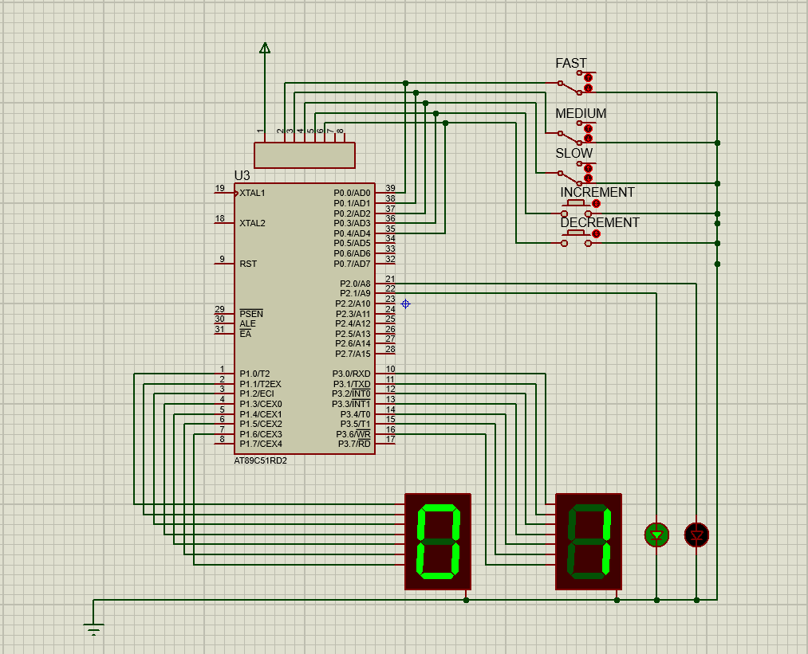

# Trassembly

  
  

## Table of Contents

-   [About the Project](#about-the-project)
-   [Toolbox](#toolbox)
-   [Setting Up the Environment](#setting-up-the-environment)
-   [Our Team](#our-team)
-   [Acknowledgements](#acknowledgements)
-   [About](#about)

## About The Project

A Traffic Light System Using Assembley and 8051 MCU

## Toolbox

- Proteus
- Assembly
- Silicon Labs C8051F020 Kit
## Setting Up the Environment

The Project has four main files:

1. **app.asm**: this file contains the assembly code for running the logic on the AT89C51RD2 on proteus, which is very close to the hardware kit in design
1. **kit.asm**: this file contains the assembly code for running the logic on the Silicon Labs C8051F020 kit
1. **Traffic.pdsprj**: this is the proteus simulation file
1. **makefile**: it contains the configuration for compiling the app and generating the hex file for proteus simulation

to run the app, you have to install SiLabs IDE and add its path to the makefile file